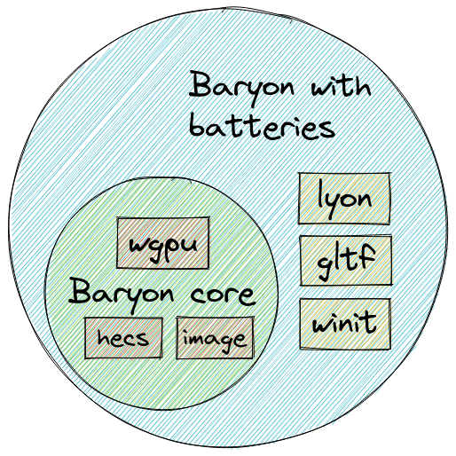
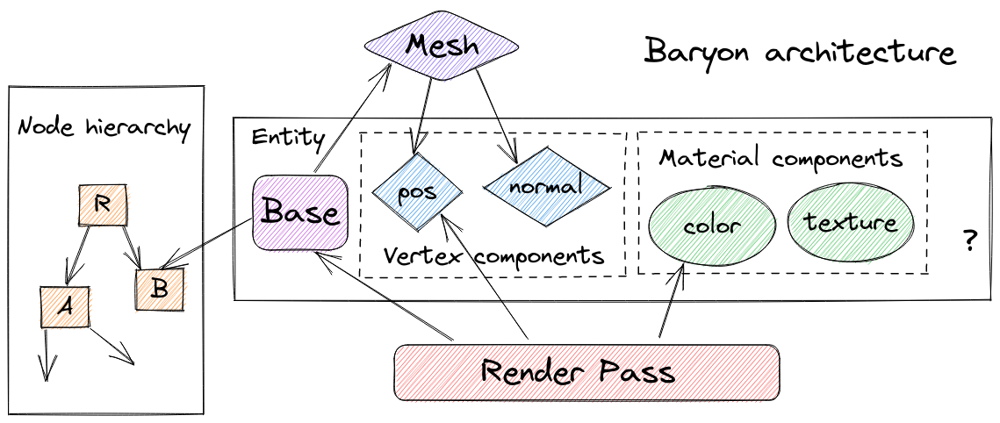

# baryon

Flexible prototyping engine.

Dzmitry Malyshau

---

## History

https://github.com/three-rs/three


---

... the heart was in the right place

## Goals
- easy to prototype (batteries included)
- solid portable graphics stack (wgpu)
- scalable to a lot of entities
- very little magic in the API

---

What vertex format should I pick?
What is exactly is a material?
How much **opinion** do I need to have?

---



---

How much would ECS help?
Bevy, Rend3, and Dotrix - already use it, but very differently.

---

Dotrix:
```rust
let mesh_handle = assets.register::<Mesh>("sphere::mesh");
world.spawn(vec![
    (pbr::solid::Entity { // whole component
        mesh: mesh_handle,
        texture: albedo,
        translate: Vec3::new(0., 0., 0.),
        ..Default::default()
    },)
]);
```

---

Rend3:
```rust
let mesh = rend3::types::MeshBuilder::new(vertex_positions.to_vec(), rend3::types::Handedness::Left)
    .with_indices(index_data.to_vec())
    .build() // produces `rend3::types::Mesh`
    .unwrap()
let material = rend3_routine::pbr::PbrMaterial {
    albedo: rend3_routine::pbr::AlbedoComponent::Value(glam::Vec4::new(0.0, 0.5, 0.5, 1.0)),
    ..rend3_routine::pbr::PbrMaterial::default()
};
let object = rend3::types::Object {
    mesh_kind: rend3::types::ObjectMeshKind::Static(renderer.add_mesh(mesh)),
    material: renderer.add_material(material), // generic <M>
    transform: glam::Mat4::IDENTITY,
};
let object_handle = renderer.add_object(object);
```

---

Bevy:
```rust
let mesh = meshes.add(Mesh::from(shape::Cube { size: 1.0 })); // prelude
let material = materials.add(StandardMaterial { // prelude
    base_color: Color::PINK,
    ..Default::default()
});
commands.spawn_bundle(PbrBundle { // prelude
    mesh,
    material,
    transform: Transform::from_xyz((x as f32) * 2.0, (y as f32) * 2.0, 0.0), // prelude
    ..Default::default()
});
```

---

Baryon (disclaimer):
  - really just a toy
  - not nearly as useful as all the engines here ^

---

Baryon (entity):
```rust
let prototype = // essentially, a bundle of vertex data components
    Geometry::cuboid(Streams::empty(), mint::Vector3 { x: 1.0, y: 1.0, z: 1.0 })
    .bake(&mut context);
let node = scene
    .add_node()
    .position(mint::Vector3 { x: 0.0, y: 0.0, z: 1.0 + SCALE_LEVEL })
    .scale(SCALE_LEVEL)
    .parent(parent_node)
    .build(); 
let entity = scene
    .add_entity(prototype)
    .parent(node)
    .component(level.color) // material?
    .build();
```

---

Baryon (update & render):
```rust
let mut pass = baryon::pass::Solid::new(
    &baryon::pass::SolidConfig {
        cull_back_faces: true,
    },
    &context,
);
...
scene[node].pre_rotate( // node indexed directly
    mint::Vector3 { x: 0.0, y: 0.0, z: 1.0 },
    delta * level.speed,
);
context.present(&mut pass, &scene, &camera);
```

---



---

Demo & Question time!


---
