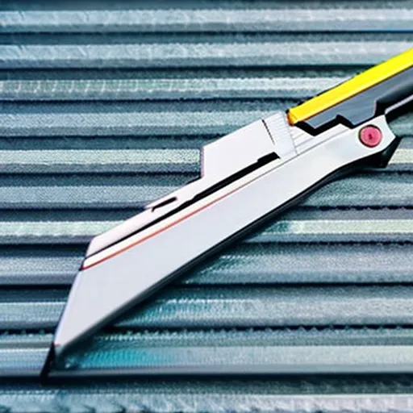
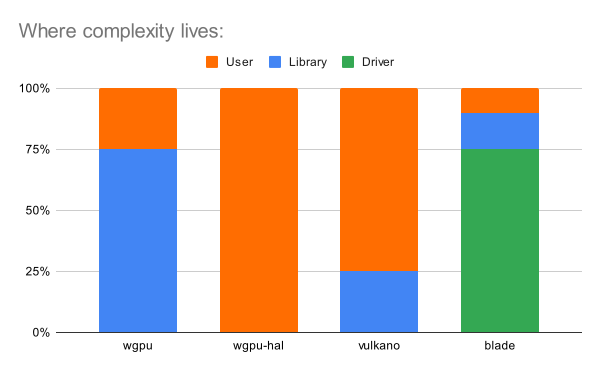

# Blade

gfx, luminance, vulkano, wgpu, rafx, sierra ...
Yet *another* graphics library?



## Case: vange-rs

[Rusty Vangers](https://vange.rs/):
  - 15 pipelines
  - 7 pipeline layouts, 8 bind group layouts
  - .. after [removing GPU physics](https://github.com/kvark/vange-rs/commit/c54426c3d6438dd1fd34e2d26147d06fff5065f9)

<!--
yes, but different
must be FUN
other examples: Veloren
-->

## Lean



<!--
Who does the heavy lifting?
wgpu-hal, rafx-api, sierra: **user**
vulkano: user/types/macros/library
wgpu, rafx, arcana: **library**
blade: **driver**
-->

## State tracking

No per-object state. No image layout transitions.
Global barriers between passes.
```rust
if let pass = encoder.compute() {
    pass.dispatch(..);
}
```
<!-- all images are VK_LAYOUT_GENERAL -->

## State tracking: example

1. Create a resource
2. Use in a compute/render/transder pass
3. Submit the command encoder.

## Binding model

No layouts. No descriptor sets.
No uniform buffers, just plain data.

<!-- no headache, no caching -->

### Binding model: define group

```rust
#[derive(bytemuck::Pod]
struct MyUniformStruct {
    data: u32
}
#[derive(blade::ShaderData)]
struct Foo {
    texture: blade::TextureView,
    uniform: MyUniformStruct,
}
```

### Binding model: pipeline creation

```rust
let foo_layout = <Foo as blade::ShaderData>::layout();
context.create_pipeline(blade::ComputePipelineDescriptor {
  data_layouts: &[&foo_layout],
});
```

### Binding model: binding

```rust
pass.bind(0, &Foo {
    texture: my_texture_view,
    uniform: MyUniformStruct { // plain data
        data: 1,
    },
});
```

## Mean

- Totally *unsafe*: use at your own risk.
- No tools: ask your local GPU vendor.
- Incomplete: customize for your needs.

<!-- use your own validation and capturing -->

### Mean: shortcuts

Who needs vertex buffers, anyway?

One context - one window.

### Mean: bright your own maintainer

All libraries: we got you!
Blade: BYOM

## Ergonomics

Resource objects: light and copyable.

Context: Has everything, internally synchronized.

## API: Shaders

Validated WGSL modules.
Without resource binding decorations!

# Why not use Blade?

Horribly incomplete!
