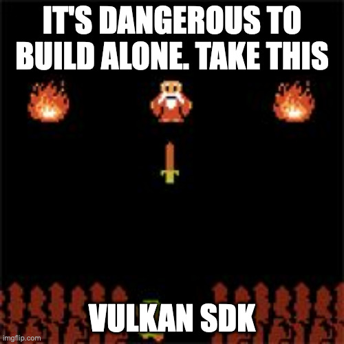
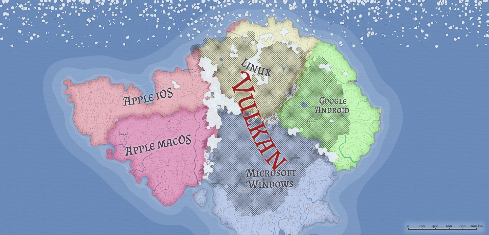
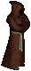
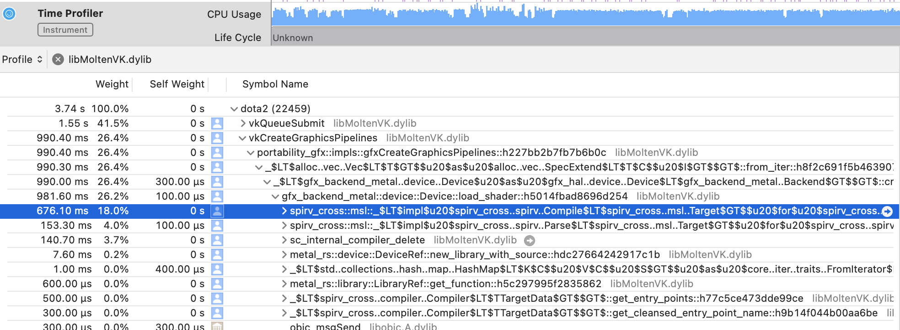
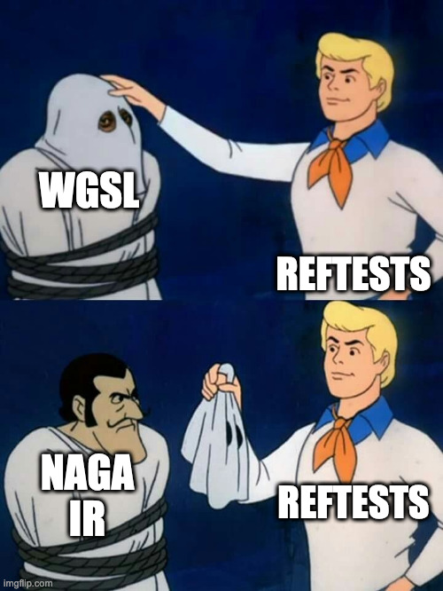
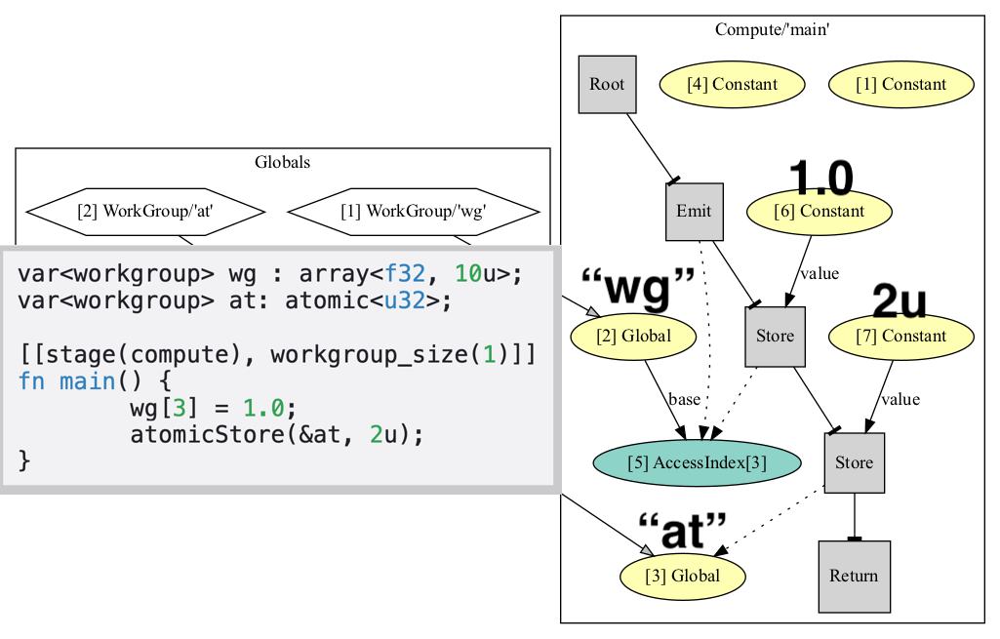
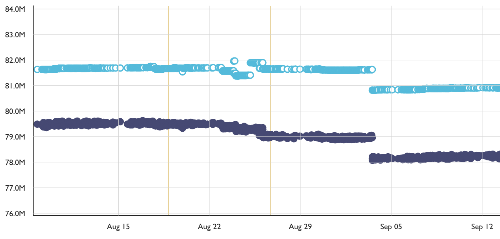
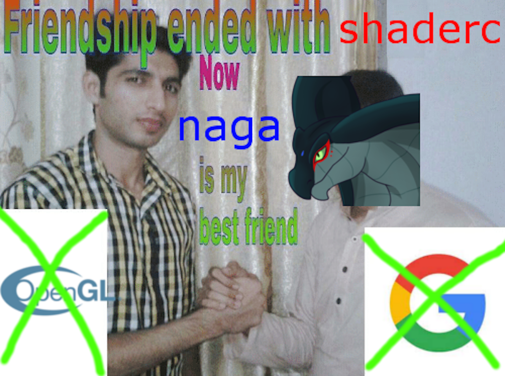

<!--
We are going to start with an overview of different ways Rust community translates shaders, focusing on SPIR-V->Metal and GLSL->SPIR-V paths. We'll explain how existing tools, being wrappers of C libraries backed by some of the Khronos members, are sub-optimal for Rust use. Finally, we'll demonstrate how a pure-Rust shader processor Naga helped to solve these issues, and even started benefiting non-Rust applications.
-->
<!--
Processing shaders with Rust 
Story of working with shaders in Rust, building a new foundation for translating shaders from/into various endpoints, nasty nature of SPIR-V, and the promise of WGSL.
-->

# Processing Shaders
(with Rust)

Dzmitry Malyshau
Rust Los Angeles Meetup, 2021

---

Plan:
  1. A sad situation
  2. The new hope
  3. Results

---

# Part I: Surrounded by C

---

## Level-1: Starter pack

> I want to draw a triangle!


*Write*: GLSL 320 or ES 300

*Run* in OpenGL/ES (gl-rs, luminance)

---

### GL/GLSL

Easy to write, easy to run.

*Tooling*: basic *pre-processing*.
*Issues*: poor support, debugging.

<!-- footer: '
GL implementations are all over the place.
Every IHV has its own interpretation.
https://github.com/servo/webrender/wiki/Driver-issues
' -->
---
<!-- footer: '' -->

## Level 2: Raw Power

> I heard Vulkan is fast!


*Write*: GLSL Vulkan flavor

*Run* in Vulkan (ash, erupt, vulkano)

---

### GLSL -> SPIR-V

Still easy to write, but hard to run.

*Tooling*: "glslang" (via "shaderc")
*Issues*: big C dependency, non-portable.

---


---



---

### C horror-1: parallelism

[google/shaderc#945](https://github.com/google/shaderc/issues/945)

> Currently shaderc can't be run in parallel at all, it will internally synchronize all threads in GlslangInitializer::Acquire which has a global mutex.


---

Wait...
Vulkan + SPIR-V
non-portable?

---



---

## Level 3: Portability

> Everything can be solved by another layer of abstraction


*Write*: Vulkan-style GLSL
*Run* in whatever platforms support: winapi-rs, d3d12-rs, metal-rs, ash, etc

---

### GLSL -> SPIRV -> MSL/HLSL/GLSL/etc

Still easy to write, but very hard to run.

*Tooling*: SPIRV-Cross
*Issues*: huge C dependency, slow.

---

### C horror-2: object prefix

[rust-lang/rust#66285](https://github.com/rust-lang/rust/issues/66285)

> because the C++ files in the spirv_cross crate began with the spirv_cross prefix

```rust
if skip_objects && (
    !fname.starts_with(&obj_start) || !fname.ends_with(".o")
)
```
---

### C horror-3:

[denoland/rusty_v8#465](https://github.com/denoland/rusty_v8/issues/465)

> Because the different libc++ implementations aren't necessarily binary compatible, values end up being assigned wrong fields (e.g. c from above is assigned to the string's internal _size_ when rusty_v8 is loaded).

---

### Other C dep weirdness

[alexcrichton/cc-rs#454](https://github.com/alexcrichton/cc-rs/issues/454)

> cc-rs: Parse "--driver-mode cl" option of the toolchain

[KhronosGroup/SPIRV-Cross#1193](https://github.com/KhronosGroup/SPIRV-Cross/pull/1193)

> spirv-cross: Avoid including stdexcept in no-exception environment

---

## Level π: Stubborn

> I don't need no shading language



Write: Rust
Run: everywhere

---

### Rust -> SPIR-V -> other

*Tooling*: 🐉 Rust-GPU
*Issues*: Limited to build-time, no standard

Plus everything about SPIRV-Cross

---

### Project: gfx-rs/portability

Goal: run Vulkan-ish everywhere
Shaders: SPIRV -> anything

  

---



---

Wait, but...
SPIRV-Cross is by Khronos
right?

<!-- footer: '
Khronos doesnt make tools.

And Google went with Tint.
' -->
---
<!-- footer: '' -->

Other shortcomings:
- fail to re-use the AST
- fail to extend (e.g. for argument buffers)

```rust
    unsafe fn create_shader_module(...) {
        //TODO: we can probably at least parse here and save the `Ast`
    }
```

---

But... `VkPipelineCache`

https://therealmjp.github.io/posts/shader-permutations-part1/

> t's true that D3D12 and Vulkan both provide mechanisms for manual caching of PSO's by the application, however these APIs tend to be complex and still don't help your "first boot" loading times.

---

## Conclusion
  - GLSL -> SPIR-V: 😬 painful 
  - SPIR-V -> anything: 😩 even more so

---

# Part II: In Rust We Trust

---

## Project: Javelin

https://gfx-rs.github.io/2019/07/13/javelin.html

SPIR-V - open standard for a binary shader format?
Let's take it as an IR.

---

### Learning SPIR-V

1. denial - *we are here*
1. anger
1. bargaining
1. depression
1. acceptance

---

### rspirv

https://github.com/gfx-rs/rspirv
[35 PRs](https://github.com/gfx-rs/rspirv/pulls?q=is%3Apr+author%3Akvark) later...
Still a mess, not an IR.

---

### Depression
Year later...
http://kvark.github.io/spirv/2021/05/01/spirv-horrors.html
> SPIR-V is probably a good format for what it was made for: driver compilers. It’s not as good for the intermediate portable representations of your shaders.

---

### Few Issues

- multiple entry points are great concept that isn't tested, doesn't work properly
- specification is effectively split in 3 documents
- recovering control flow structure is hard

<!-- footer:'
And glslc produces aweful code for constant arrays.
'-->
---
<!-- footer:'' -->

## WGSL

Born at the start of 2020
Designed to actually target other languges
Sane

---

### Example

```rust
[[stage(vertex)]]
fn main_vs(in: Vertex) -> [[builtin(position)]] vec4<f32> {
    let world = locals.pos_scale.w * qrot(locals.rot, in.pos) + locals.pos_scale.xyz;
    return globals.view_proj * vec4<f32>(world, 1.0);
}

[[stage(fragment)]]
fn main_fs() -> [[location(0)]] vec4<f32> {
    return locals.color;
}
```

---

## Project: Naga


---

## Bring Your Own IR

Initial architecture:
- IR from scratch, inspired by SPIR-V
- WGSL/SPIRV -> SPIRV/MSL

---

## Naga: Principles

- pure Rust 🦀
- cache-friendly data structures
- fully safe, panic-free

---

### Principle: Pure Rust

**Enums** is a killer feature for compiler tech:

```rust
pub enum Binding {
    BuiltIn(BuiltIn),
    Location {
        location: u32,
        interpolation: Option<Interpolation>,
        sampling: Option<Sampling>,
    },
}
```

---

### Principle: Cache-friendly

Everything is an array, indexed, grow-only.
*Types, constants, functions, expressions, etc*

---

### Principle: Safe and Sound

```rust
#![deny(clippy::panic)]
```

Only unsafe code is isolated in `Arena`.

---

### Naga: Components

**WGSL** | SPIR-V | GLSL
⇓
module **IR** | validator | derived info
⇓
**WGSL** | SPIR-V | MSL | HLSL | GLSL | DOT

---

### Naga: Parsing

We tried many helper crates: pest, nom, glsl.
*General issue*: split of responsibilities.
Ended up with *recursive descend*.

---

### Naga: Criss-Cross Testing

*Backends*: WGSL -> anything
*Frontends*: anything -> WGSL

<!--footer: '
General testing approach is "defence in depth" -
testing on multiple levels.
'-->
---
<!--footer: ''-->



---

### Naga: Architecture

**Statements** - flow and mutability
**Expressions** - pure values

---



<!--footer: '
IR behind the scenes.
' -->
---
<!--footer: ''-->

# Part III: Aftermath

---

## Level 4: Pure


Write: WGSL (or GLSL)
Run: everywhere

---

### WGSL/GLSL -> Naga IR -> other

*Tooling*: Naga
*Issues*: lack of polish, limited features

---

## Project: Gecko


Goal: run WebGPU everywhere
Before: SPIRV -> anything (via SPIRV-Cross)
After: WGSL -> anything (via Naga)

---



<!--footer: '
Installer size change after removing SPIRV-Cross.
' -->
---
<!--footer: ''-->

## Project: Veloren

[veloren/veloren#2749](https://gitlab.com/veloren/veloren/-/merge_requests/2749)

Replacing `shaderc` with `naga`.
Not a success story yet - got **reverted**
because SPIRV-Cross weirdness, fixes needed to shaders

<!--footer: '
Indexing constant arrays generates slow MSL code.
'-->
---
<!--footer: ''-->

## Project: vange-rs

[kvark/vange-rs#143](https://github.com/kvark/vange-rs/pull/143)
All shaders are rewritten in WGSL.

---



---

## Project: noclip.website

[magcious/noclip.website#8cd6ac7d](https://github.com/magcius/noclip.website/commit/b4505ea2b092d04dda14b8beb88d76aa8cd6ac7d#diff-29c41667cbbb64ae57bf69bc6b07f59f5b70309e3f2a6bcc186192ff3d9e4a6d)

GLSL -> WGSL (via Naga) for WebGPU deployment
WASM size: glslang = 1.04mb, naga = 0.56mb

---

## Project: gfx-rs/portability

https://gfx-rs.github.io/2021/05/09/dota2-msl-compilation.html

4x faster pipeline creation (with driver cache)
A couple of seconds shaved off Dota2 launch.

---

# Takeaway

1. Existing tooling around SPIR-V isn't perfect.
SPIR-V isn't a good IR.

2. There are more ways to write shaders than just GLSL.

3. Shader processing with Rust is fun!
We are almost there ;)

---

# Thank you!

Questions?
