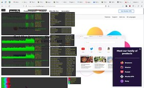

<!-- footer: '' -->

# wGPU Challenges

Dzmitry Malyshau, 2021

---
<!-- footer: '' -->

## About Me

  

- _Mozilla Firefox_
- _Rockstar Games_
- _JVL Inc game machines_
- bunch of other things...

---
<!-- footer: '' -->


---
<!-- footer: '' -->

## WebGPU: Requirements

  - safe and secure
  - works on all modern platforms
  - behaves portably
  - (bonus) comes with a shading language!

---
<!-- footer: '' -->

## Problem-1: Cross APIs


---
<!-- footer: '' -->


---
<!-- -->

Available resources:
  - 1 engineer + community
  - https://github.com/gfx-rs/gfx
  - VkPortability wrapping


<!-- footer: '
  When all you have is Vulkan, everything looks like a Portability problem.
' -->
---
<!-- footer: '' -->

### Solution-1-I: Vulkanized


---
<!-- footer: '' -->

Effort: 6-12 months to build into the browser.
Using gfx-portability and iterating on it.

### Good:
  - runs well on Vulkan
  - can use existing tooling, like SPIRV-Cross

---
<!-- footer: '' -->


<!-- footer: '
  ... a lot of code
' -->

---
<!-- footer: '' -->

### Solution-1-II: Native Implementation


---
<!-- footer: '' -->

[Hardware Abstraction Layer](https://github.com/gfx-rs/wgpu/tree/master/wgpu-hal)

- explicit barriers
- explicit command allocators
- fully unsafe
- near-zero overhead
- efficient API intersection
- shares types with the rest of `wgpu`

---
<!-- footer: '' -->


Effort: 2 months to build from scratch.

---
<!-- footer: '' -->

## Problem-2: Shading language

No text SPIR-V, no C-like syntax.

Hard safety and portability requirements.

```rust
[[stage(fragment)]]
fn fs_extra() -> [[location(0)]] vec4<f32> {
    return vec4<f32>(0.0, 0.5, 0.0, 0.5);
}
```

---
<!-- footer: '' -->

### Solution-2: Naga

In-house [shader translation](https://github.com/gfx-rs/naga) from anything to anything.
Lightning fast! Roughly 4x faster than SPIRV-Cross.

First-class support for WGSL.

Proof of concept took 1 month. Development is ongoing.

<!-- footer: '
  Turns out, writing from scratch isnt that difficult!
  Or so it seemed at start.
' -->
---
<!-- footer: '' -->


---
<!-- footer: '' -->

### Native Path: Results


---
<!-- footer: '' -->

## Problem-3: Implicit synchronization

- like D3D11, Metal, or OpenGL, but specified
- or like D3D12, but with full *implicit promotion/decay*

---
<!-- footer: '' -->

### Solution-3a: Usage Groups


---
<!-- footer: '' -->

### Solution-3b: Command Injection


<!-- footer: '
  Creating many small command buffers.
' -->
---
<!-- footer: '' -->

## Problem-4: Multi-threading

- recording command buffers on different threads
- creating resources on different threads
- easy to get into a deadlock

---
<!-- footer: '' -->

#### Solution-4: Access Order


---
<!-- footer: '' -->

### Results

- the only safe GPU abstraction in town
- runs on everything (*)
- accessible from Native (*) and Web

<!-- footer: '
 ... with help of Angle currently

 Has bindings for C, D, Python, Java, Julia, etc
' -->
---
<!-- footer: '' -->

## Lesson-1

> Abstraction has to be driven by something.


<!-- footer: '
Anticipating future use isn't helpful.
' -->
---
<!-- footer: '' -->

## Lesson-2

> Re-inventing things has its place.


<!-- footer: '
Existing solutions, like libraries, or standards,
aren't always a good fit.
' -->
---
<!-- footer: '' -->

## Lesson-3

> Community power is misleading.


<!-- footer: '
The only unstoppable power is a motivated individual.
' -->
---
<!-- footer: '' -->


# Questions?
